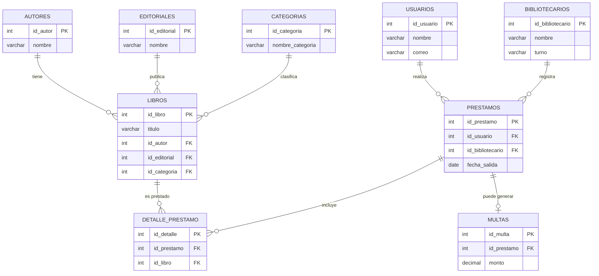

# Sistema de biblioteca

## Integrantes del equipo
* Iván Enrique Cruz Acosta (Matricula: 210690)
* Nary Enrique Lopez Mendoza (Matricula: 210361)
* Fredier Antonio Sanchez Estrada (Matricula: 184099)

## Índice
1. [Objetivo del sistema](#objetivo-del-sistema)
2. [Narrativa del sistema](#narrativa-del-sistema)
3. [Modelo E-R](#modelo-e-r)
4. [Sentencias SQL](#sentencias-sql)

## Objetivo del sistema

## Narrativa del sistema

## Modelo E-R



## Sentencias SQL
```sql
CREATE TABLE Autores (
    id_autor INT PRIMARY KEY AUTO_INCREMENT, 
    nombre VARCHAR(100)
    );

CREATE TABLE Editoriales (
    id_editorial INT PRIMARY KEY AUTO_INCREMENT, 
    nombre VARCHAR(100)
    );

CREATE TABLE Categorias (
    id_categoria INT PRIMARY KEY AUTO_INCREMENT, 
    nombre_categoria VARCHAR(50)
    );

CREATE TABLE Usuarios (
    id_usuario INT PRIMARY KEY AUTO_INCREMENT, 
    nombre VARCHAR(100), 
    correo VARCHAR(100) UNIQUE
    );

CREATE TABLE Bibliotecarios (
    id_bibliotecario INT PRIMARY KEY AUTO_INCREMENT, 
    nombre VARCHAR(100), 
    turno VARCHAR(20)
    );

-- Tablas con llaves foráneas
CREATE TABLE Libros (
    id_libro INT PRIMARY KEY AUTO_INCREMENT,
    titulo VARCHAR(150),
    id_autor INT,
    id_editorial INT,
    id_categoria INT,
    FOREIGN KEY (id_autor) REFERENCES Autores(id_autor),
    FOREIGN KEY (id_editorial) REFERENCES Editoriales(id_editorial),
    FOREIGN KEY (id_categoria) REFERENCES Categorias(id_categoria)
);

CREATE TABLE Prestamos (
    id_prestamo INT PRIMARY KEY AUTO_INCREMENT,
    id_usuario INT,
    id_bibliotecario INT,
    fecha_salida DATE,
    FOREIGN KEY (id_usuario) REFERENCES Usuarios(id_usuario),
    FOREIGN KEY (id_bibliotecario) REFERENCES Bibliotecarios(id_bibliotecario)
);

CREATE TABLE Detalle_Prestamo (
    id_detalle INT PRIMARY KEY AUTO_INCREMENT,
    id_prestamo INT,
    id_libro INT,
    FOREIGN KEY (id_prestamo) REFERENCES Prestamos(id_prestamo),
    FOREIGN KEY (id_libro) REFERENCES Libros(id_libro)
);

CREATE TABLE Multas (
    id_multa INT PRIMARY KEY AUTO_INCREMENT,
    id_prestamo INT,
    monto DECIMAL(10,2),
    FOREIGN KEY (id_prestamo) REFERENCES Prestamos(id_prestamo)
);
```