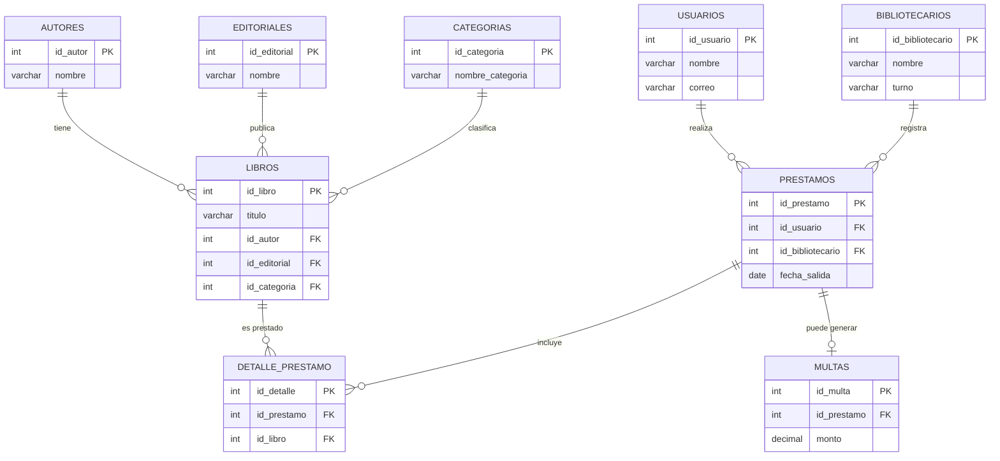

# Sistema de biblioteca

## Integrantes del equipo
* Iván Enrique Cruz Acosta (Matricula: 210690)
* Nary Enrique Lopez Mendoza (Matricula: 210361)
* Fredier Antonio Sanchez Estrada (Matricula: 184099)

## Índice
1. [Objetivo del sistema](#objetivo-del-sistema)
2. [Narrativa del sistema](#narrativa-del-sistema)
3. [Modelo E-R](#modelo-e-r)
4. [Sentencias SQL](#sentencias-sql)

## Objetivo del sistema

La función principal de la base de datos es gestionar la información que se tiene de una biblioteca, entre las funciones básicas encontramos el controlar la información sobre autores, editoriales, categorías y libros, por otro lado también se puede administrar a los usuarios y a los bibliotecarios que se registren en el sistema.

Además, el sistema permite controlar el préstamo de libros, registrando qué usuario solicita un préstamo, qué bibliotecario lo autoriza y qué libros están incluidos en cada préstamo. También facilita el registro de multas asociadas a los préstamos, permitiendo llevar un control sobre los montos generados.

De esta forma, el sistema busca organizar y mantener el control de los libros y las funciones de préstamo dentro de la biblioteca, asegurando un registro claro de los usuarios, los libros prestados y las posibles sanciones económicas.

Hacer el proceso de manera manual puede resultar complicado y engorroso ya que se necesita ser preciso con la información enfocándose en qué libros existen, quién los solicita, quién autoriza los préstamos y si existen multas asociadas. También recordemos que la información está relacionada y si quieres hacer una modificación el sistema te puede avisar de algún error , en cambio al ser en físico no sabes si cometiste un error a menos de que veas todos tus datos. Por otro lado también sería más fácil buscar información, en el sistema pondrías en nombre de un autor  encontrarás sus libros o también buscar a un usuario y si este lleva multas.

En resumen al tener el sistema se puede evitar que se duplique los datos, también que modifica los datos, en este caso el bibliotecarios, buscar información es más fácil, consultar los préstamos , en resumen hace que los procesos tomen menos tiempo y mejora la eficiencia en la biblioteca.

La base de datos está compuesta por nueve tablas que permiten organizar la información en diferentes entidades y establecer relaciones entre ellas mediante llaves primarias (PRIMARY KEY) y llaves foráneas (FOREIGN KEY).

* Autores.
* Editoriales.
* Categorías.
* Usuarios.
* Bibliotecarios.
* Libros
* Préstamos.
* Detalle_Préstamos.
* Multas


## Narrativa del sistema

El sistema de gestión bibliotecaria surge como una solución integral ante la ineficiencia y los riesgos de pérdida de información inherentes a los métodos de registro manual. El diseño del sistema no se limita a ser una simple agenda de contactos, sino que se constituye como un entorno relacional dinámico donde cada dato depende de otro para mantener la coherencia operativa de la institución.

I. La Estructura del Conocimiento (Catálogo de Libros)
El corazón del sistema es la tabla de Libros, pero esta no funciona de forma aislada. Para evitar la redundancia de datos (un error común en registros físicos donde el nombre de un autor se escribe de cinco formas distintas), el sistema desglosa la información en entidades maestras: Autores, Editoriales y Categorías.

Al registrar un nuevo ejemplar, el bibliotecario no escribe el nombre del autor; lo selecciona de un catálogo preexistente vinculado mediante llaves foráneas. Esto permite que, con un solo clic, el sistema pueda generar reportes exhaustivos como: "Listar todos los libros de la categoría 'Ciencia Ficción' publicados por la 'Editorial Alfaguara' cuyos autores sean de origen latinoamericano".

Esta arquitectura garantiza que, si se decide corregir el nombre de una editorial, el cambio se refleje automáticamente en los miles de libros asociados a ella, manteniendo la integridad de la base de datos de manera global.

II. Gestión de Actores y Responsabilidades
El sistema reconoce dos tipos de actores humanos con roles claramente diferenciados:

Usuarios: Son los clientes o lectores. El sistema almacena su información personal para permitir su identificación unívoca. Cada usuario posee un historial que lo sigue: libros leídos, frecuencia de visitas y, lo más importante, su estatus de solvencia (si tiene multas pendientes o no).

Bibliotecarios: Son los administradores del sistema. La narrativa del software establece que ninguna acción de préstamo ocurre en el vacío; cada transacción debe ser autorizada por un bibliotecario registrado. Esto crea una cadena de custodia y responsabilidad, permitiendo auditar quién aprobó la salida de un libro valioso en una fecha determinada.

III. El Ciclo de Vida del Préstamo y Detalle
La operación más crítica del sistema es el proceso de salida de material. A diferencia de un cuaderno de bitácora, el sistema separa el préstamo en dos niveles para maximizar la precisión:

La Tabla Préstamos: Registra la cabecera de la transacción (quién se lleva los libros, qué bibliotecario autoriza y en qué fecha se realiza la operación).

La Tabla Detalle_Préstamos: Esta es una tabla de ruptura que permite que un usuario se lleve varios libros bajo un mismo folio de préstamo. Aquí se especifica exactamente qué títulos salieron de los estantes.
Esta separación permite que el sistema detecte errores lógicos: si un bibliotecario intenta prestar un libro que ya está marcado como "fuera de stock" o "en préstamo", el sistema genera una alerta inmediata, impidiendo la duplicidad de la transacción, algo que en papel solo se descubriría tras una revisión exhaustiva y tardía.

IV. Régimen de Control y Sanciones (Multas)
Para asegurar el retorno oportuno de los ejemplares, el sistema integra un módulo de Multas. Esta entidad está directamente vinculada a la tabla de préstamos. La narrativa del sistema establece que la base de datos es capaz de calcular, basándose en la fecha de devolución esperada vs. la fecha real, si un usuario ha incurrido en una falta.
El registro de multas permite llevar un control contable de los montos generados, los montos pagados y los saldos pendientes. Un usuario con multas activas puede ser restringido automáticamente por el sistema para nuevos préstamos, forzando así una cultura de responsabilidad y cuidado del material bibliográfico.

V. Ventajas Competitivas de la Automatización
Finalmente, la narrativa del sistema destaca la facilidad de recuperación de información. Mientras que en un sistema físico buscar un libro por "Categoría" obligaría al personal a recorrer los pasillos o revisar ficheros por horas, en este sistema digital basta con una consulta filtrada. La capacidad de realizar modificaciones masivas sin riesgo de "datos huérfanos", la eliminación de la duplicidad de registros y la mejora drástica en los tiempos de atención al usuario final, convierten a esta base de datos en una herramienta de gestión estratégica que eleva la eficiencia institucional a niveles profesionales.

## Modelo E-R



## Sentencias SQL
```sql
CREATE TABLE Autores (
    id_autor INT PRIMARY KEY AUTO_INCREMENT, 
    nombre VARCHAR(100)
    );

CREATE TABLE Editoriales (
    id_editorial INT PRIMARY KEY AUTO_INCREMENT, 
    nombre VARCHAR(100)
    );

CREATE TABLE Categorias (
    id_categoria INT PRIMARY KEY AUTO_INCREMENT, 
    nombre_categoria VARCHAR(50)
    );

CREATE TABLE Usuarios (
    id_usuario INT PRIMARY KEY AUTO_INCREMENT, 
    nombre VARCHAR(100), 
    correo VARCHAR(100) UNIQUE
    );

CREATE TABLE Bibliotecarios (
    id_bibliotecario INT PRIMARY KEY AUTO_INCREMENT, 
    nombre VARCHAR(100), 
    turno VARCHAR(20)
    );

-- Tablas con llaves foráneas
CREATE TABLE Libros (
    id_libro INT PRIMARY KEY AUTO_INCREMENT,
    titulo VARCHAR(150),
    id_autor INT,
    id_editorial INT,
    id_categoria INT,
    FOREIGN KEY (id_autor) REFERENCES Autores(id_autor),
    FOREIGN KEY (id_editorial) REFERENCES Editoriales(id_editorial),
    FOREIGN KEY (id_categoria) REFERENCES Categorias(id_categoria)
);

CREATE TABLE Prestamos (
    id_prestamo INT PRIMARY KEY AUTO_INCREMENT,
    id_usuario INT,
    id_bibliotecario INT,
    fecha_salida DATE,
    FOREIGN KEY (id_usuario) REFERENCES Usuarios(id_usuario),
    FOREIGN KEY (id_bibliotecario) REFERENCES Bibliotecarios(id_bibliotecario)
);

CREATE TABLE Detalle_Prestamo (
    id_detalle INT PRIMARY KEY AUTO_INCREMENT,
    id_prestamo INT,
    id_libro INT,
    FOREIGN KEY (id_prestamo) REFERENCES Prestamos(id_prestamo),
    FOREIGN KEY (id_libro) REFERENCES Libros(id_libro)
);

CREATE TABLE Multas (
    id_multa INT PRIMARY KEY AUTO_INCREMENT,
    id_prestamo INT,
    monto DECIMAL(10,2),
    FOREIGN KEY (id_prestamo) REFERENCES Prestamos(id_prestamo)
);
```